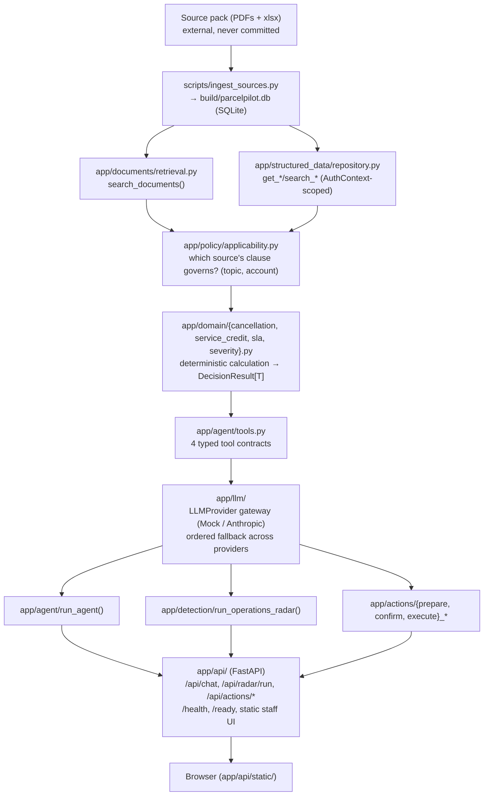

# ParcelPilot Ops Copilot

An internal support/operations assistant for ParcelPilot staff, exposed as
a FastAPI service with a minimal staff web UI. It answers plain-language
questions about a customer, order, or ticket with a grounded, cited,
trust-scored answer; proactively surfaces operational issues (SLA
breaches, recurring patterns, known-issue matches) before anyone asks
about them; and lets an eligible ticket be escalated through an explicit
prepare/confirm/execute workflow - never automatically.

## Product

Three surfaces over one deterministic core:

- **Support Copilot** - a bounded agent (`app/agent/`) that resolves
  entities and intent deterministically, plans and executes only
  approved tools, builds a verified evidence pack, applies a hard trust
  gate, and composes a grounded, cited answer. The LLM renders an
  answer; it never decides a fee, deadline, severity, or which source
  wins a conflict - that's deterministic Python, computed first and
  handed to the model as facts it's told not to alter.
- **Operations Radar** (`app/detection/`) - six deterministic detection
  rules (SLA breach, SLA approaching, recurring high-severity volume,
  known-issue pattern, carrier-fault pattern, overdue pickup) that scan
  authorization-scoped data and produce evidence-backed alerts with a
  deterministic fingerprint, so the same underlying evidence never
  produces a duplicate alert. An optional LLM pass may add a short prose
  summary to an already-decided alert; it cannot change the count,
  threshold, severity, affected accounts, or evidence.
- **Escalation workflow** (`app/actions/`) - `prepare_escalation` (a
  deterministic P1-or-breached eligibility check, non-mutating except for
  its own audit row), `confirm_action` (re-validates authorization,
  expiry, payload integrity, and target state), `execute_action`
  (idempotent). Three separate calls, always - nothing is escalated
  without an explicit confirmation step in between.

See [`docs/product_note.md`](docs/product_note.md) for what this can and
can't do today from a user's perspective, and
[`docs/architecture_note.md`](docs/architecture_note.md) for how the
agent, detection, and action layers work internally.

## Architecture



Full rationale for every decision:
[`docs/architecture_decision_record.md`](docs/architecture_decision_record.md).

## Key design principles

- **Evidence first.** Every domain result carries typed `EvidenceRef`s
  (document + page/section, structured record, or calculation) - never a
  claim without a citation the caller can check.
- **Deterministic business rules.** Fees, deadlines, severities,
  eligibility, and detection thresholds are Python, not model output. An
  LLM call happens only after the fact is already decided, to render it.
- **Authorization at the data/tool layer.** `AuthContext` account-scope
  filtering is enforced inside the repository functions every tool and
  detection rule reads through - never re-derived from a caller's own
  request arguments, and never bypassable via an aggregate (a scoped
  caller can't infer another account's count even through Operations
  Radar's cross-account rules).
- **Bounded agent execution.** A fixed tool registry, a budget on tool
  calls/iterations/wall-clock/cost, and exactly one LLM call in the
  default path - no open-ended agent loop.
- **Explicit action confirmation.** `prepare` never mutates beyond its
  own audit row; `confirm` and `execute` are separate, explicit calls.
  The agent and Operations Radar can only *recommend* escalation in text
  - neither has a code path to actually prepare, confirm, or execute one.

## Design choices

Decisions that had a real alternative, and why the alternative lost:

- **Deterministic domain layer + LLM-as-explainer, not an LLM-decides-
  everything agent.** The alternative - let the model reason freely over
  retrieved text and state the fee/deadline itself - was rejected because
  a wrong fee or a wrong SLA verdict is a real business/compliance risk.
  Every number traces to a Python function and a citation, never to a
  model's confidence; the LLM's only job is turning an already-decided
  `DecisionResult` into readable, cited prose.
- **A fixed dataset-snapshot clock ([ADR-005](docs/architecture_decision_record.md)),
  not the real wall clock.** The system reasons about one frozen
  assessment snapshot, so every "how long ago" calculation stays
  reproducible regardless of when it's run. The real tradeoff: the
  action workflow's own audit timestamps freeze too, so its 15-minute
  expiry can't be observed from natural elapsed time in a live session -
  accepted rather than adding a second clock implementation this late.
- **Real DeepEval/MLflow libraries, not a custom evaluation harness.**
  Building a bespoke scoring framework was an explicit non-goal. A small
  adapter (`app/llm/deepeval_bridge.py`) lets DeepEval's own metric
  classes use Claude as judge instead of its default OpenAI judge - a
  documented, standard DeepEval extension pattern, not a reimplementation.
- **SQLite, not Postgres or a managed database.** The scope is one
  ~180KB dataset snapshot with a tightly bounded write pattern (one
  action-workflow row per action). A managed database would be
  infrastructure with no requirement behind it. The tradeoff: single
  writer, no connection pool - correct under real concurrency (atomic
  compare-and-swap, verified at 20-way concurrent load), not a
  throughput design past this corpus size.
- **A bounded agent - one LLM call, a fixed tool registry, hard
  budgets - not an open-ended agent loop.** Predictable cost and
  latency, and no risk of an unbounded tool-calling loop. The tradeoff:
  genuinely multi-hop reasoning beyond the four fixed tools isn't
  possible; Operations Radar exists as the separate aggregate-reasoning
  surface instead of stretching the agent to cover it.

## Evaluation

- **pytest** (`tests/`) - deterministic correctness, including golden-case
  regression suites that run real assessment facts (agent answers,
  Operations Radar alerts) through the actual engine, not hand-picked
  assertions.
- **Retrieval evaluation** - Recall@K, source hit rate, p50/p95 latency:
  [`docs/retrieval_evaluation.md`](docs/retrieval_evaluation.md).
- **DeepEval RAG/agent-trajectory evaluation** - tool-correctness and
  status-match are genuine, judge-free scores; RAG faithfulness and
  task-completion need a real judge model and are honestly reported as
  unavailable without one:
  [`docs/agent_trajectory_evaluation.md`](docs/agent_trajectory_evaluation.md),
  [`docs/deepeval_baseline.md`](docs/deepeval_baseline.md).
- **Security regressions** (public, always-runs CI tier) - cross-account
  access, tool-argument injection, prompt injection in question text and
  retrieved documents, and the full action-workflow attack list
  (unauthorized/cross-account targets, expired/replayed confirmation, a
  manipulated payload).
- **Red team** (`tests/red_team/`, 114 tests, public, always-runs CI
  tier) - identity spoofing, API authorization, action attacks,
  concurrency/race conditions, deployment failure scenarios, and more,
  run as executable adversarial tests against the real HTTP API and a
  live Docker container, not documented as threats:
  [`docs/red_team_report.md`](docs/red_team_report.md).
- **Performance** - structured-data/domain-calculation latency,
  Operations Radar detection latency, and end-to-end API latency
  (including a concurrency smoke test):
  [`docs/performance_report.md`](docs/performance_report.md).

Full consolidated results, with MEASURED vs. NOT AVAILABLE stated
explicitly: [`docs/evaluation_report.md`](docs/evaluation_report.md).
Gates: [`docs/quality_gates.md`](docs/quality_gates.md).

## Quickstart

Requires Python 3.11+ and [uv](https://docs.astral.sh/uv/).

```powershell
uv venv --python 3.12 .venv
uv pip install --python .venv\Scripts\python.exe -e ".[dev,llm,evaluation,api]"

.venv\Scripts\python.exe scripts\ingest_sources.py --source-dir "<pack>\source-pack" --db build\parcelpilot.db
.venv\Scripts\python.exe -m pytest -q

.venv\Scripts\python.exe -m uvicorn app.api.main:app --reload
# -> http://localhost:8000 (staff UI) and http://localhost:8000/docs (OpenAPI)
```

The `llm`, `evaluation`, and `api` extras are optional (`anthropic`;
`deepeval`/`mlflow`; `fastapi`/`uvicorn`/`httpx`) - omit them for a
minimal `[dev]`-only install if you only need ingestion, retrieval, and
the domain layer.

## Configuration

See `.env.example`.

| Variable | Purpose |
|---|---|
| `PARCELPILOT_SOURCE_DIR` | Path to the source pack (never committed) |
| `PARCELPILOT_DB_PATH` | SQLite database path (default `build/parcelpilot.db`) |
| `ANTHROPIC_API_KEY` | Optional. Everything defaults to `MockProvider` when unset |
| `PARCELPILOT_MODEL` | Model name used when `ANTHROPIC_API_KEY` is set (default `claude-sonnet-4-5`) |
| `DEEPEVAL_TELEMETRY_OPT_OUT` | Set to `YES` to stop DeepEval's background analytics calls (set automatically in tests) |
| `BUSINESS_*` | Business-calendar assumption placeholders ([ADR-007](docs/architecture_decision_record.md)) - unused by anything today |

MLflow tracking is local-only: `sqlite:///build/mlflow.db`, gitignored, no
server (see [ADR-020](docs/architecture_decision_record.md)).

## Deployment

```
docker build -t parcelpilot-ops-copilot .
docker run -p 8000:8000 -v <host>/parcelpilot.db:/app/build/parcelpilot.db parcelpilot-ops-copilot
```

The confidential source pack is **never** baked into the image (see
`.dockerignore`) - only an already-ingested SQLite database ever reaches
a running container, supplied by the deployment operator through one of:

1. A file mounted at `PARCELPILOT_DB_PATH` (the `docker run -v` above).
   Mount it **writable**, not read-only - `prepare_escalation` writes an
   audit row, so a read-only mount serves Support Copilot and Operations
   Radar fine but breaks the action workflow.
2. `PARCELPILOT_DB_B64_FILE` - path to a mounted file containing the
   base64-encoded database (e.g. a Kubernetes Secret), decoded at
   container start by `docker-entrypoint.sh`.
3. `PARCELPILOT_DB_B64` - the base64 content inline as an env var
   (mirrors `.github/workflows/eval.yml`'s existing secret pattern).
   Small databases only - this project's real ~180KB database already
   exceeds `docker run --env-file`'s per-line limit; prefer 1 or 2.

Without any database supplied, the container starts and `/health`
reports OK, but `/ready` honestly reports `not_ready` rather than serving
fabricated data - see `GET /ready`'s `checks` field.

Every deployment is a fixed, point-in-time **assessment snapshot**
(`2026-08-16 11:00 Asia/Kolkata` for the real pack) - the UI states this
explicitly; nothing here is "live" data.

## Development

```powershell
.venv\Scripts\python.exe -m ruff check app scripts tests
.venv\Scripts\python.exe -m pyright app scripts\ingest_sources.py scripts\run_retrieval_eval.py scripts\run_deepeval_baseline.py scripts\run_performance_benchmark.py scripts\run_agent_cli.py scripts\run_agent_trajectory_eval.py scripts\run_operations_radar_eval.py tests
.venv\Scripts\python.exe -m pytest -q
.venv\Scripts\python.exe scripts\run_retrieval_eval.py --source-dir "<pack>\source-pack"
.venv\Scripts\python.exe scripts\run_deepeval_baseline.py --source-dir "<pack>\source-pack"
.venv\Scripts\python.exe scripts\run_agent_trajectory_eval.py --source-dir "<pack>\source-pack"
.venv\Scripts\python.exe scripts\run_performance_benchmark.py --source-dir "<pack>\source-pack"
.venv\Scripts\python.exe scripts\run_operations_radar_eval.py --source-dir "<pack>\source-pack"
.venv\Scripts\python.exe scripts\run_agent_cli.py --question "Is TKT-501 within its first-response SLA?"
.venv\Scripts\python.exe scripts\run_api_load_test.py --base-url http://localhost:8000
```

A `Makefile` wraps the same commands (`make lint`, `make typecheck`, `make
test`, `make eval`, `make deepeval`, `make perf`, `make radar`, `make
check`) for contributors who have `make`.

Test tiers (`tests/`):

- `tests/fixture_backed/` - the public, always-runs CI tier: domain
  rules, authorization, retrieval, the full action workflow, Operations
  Radar, the HTTP API layer (`app/api/`), and security regressions,
  against a fabricated dataset. Never needs the real pack, never skips.
- `tests/red_team/` - executable adversarial tests (identity spoofing,
  authorization attacks, action attacks, concurrency/race conditions,
  deployment failure scenarios) against the same fabricated dataset.
  Public, always-runs CI tier, never skips.
- `tests/unit/`, `tests/integration/`, `tests/regression/`,
  `tests/evaluation/` - use the real source pack via
  `PARCELPILOT_SOURCE_DIR`, skipping gracefully (not failing) when it's
  unset, since the pack is never committed.

Built with Claude Code; see
[`docs/AI_USAGE.md`](docs/AI_USAGE.md) for what was AI-assisted versus
independently verified.

## Limitations

- Only one action type exists (`prepare_escalation`); a ticket-update
  action was explicitly optional and wasn't built.
- No bulk/aggregate questions in the agent's own question-answering
  pipeline - it's still single-entity per request; Operations Radar's
  detection rules are the aggregate-reasoning surface instead.
- Authorization is account-scope filtering, plus one role check
  (`restricted_support` is denied Operations Radar entirely); no
  field-level redaction, since no field in this schema is more sensitive
  than the account-scoped record it lives on.
- Operations Radar runs on demand against a point-in-time snapshot, not
  on a schedule, and has no persistent alert state across runs.
- Known-issue pattern matching is a token-overlap heuristic, not a
  learned or exact classifier - real, but imperfect (see
  [`docs/architecture_note.md`](docs/architecture_note.md)).
- Business-hour SLA targets are parsed but not evaluated - the pack never
  defines a business calendar.
- Real DeepEval quality scores now exist for RAG and agent task
  completion (`claude-haiku-4-5-20251001` as judge - see
  [`docs/evaluation_report.md`](docs/evaluation_report.md)); no
  pass/fail threshold is wired into CI as a release gate yet.
- `AnthropicProvider` has been exercised against a real live API call
  (CLI, `/api/chat`, and both DeepEval evaluations); its gateway
  fallback to a second provider remains construction/unit-tested only -
  only one provider/key is available.
- SQLite is single-writer with one connection per request, no pool -
  every action-workflow state transition is a single atomic conditional
  `UPDATE`, so concurrent requests are *correct* (verified under real
  20-way concurrency - see
  [`docs/red_team_report.md`](docs/red_team_report.md)), but latency
  still degrades under load at this corpus size (see
  [`docs/performance_report.md`](docs/performance_report.md)) - not a
  throughput design for a much larger one.
- No conversation memory - each question is answered independently, and
  the staff UI's demo-identity picker is a hosted-assessment stand-in for
  a real identity provider, not a design for one.

## Roadmap - closing the limitations above

- **Ticket-update action** - extend `app/actions/` with a second
  `ActionType`, reusing the prepare/confirm/execute pattern already
  hardened against race conditions and replay.
- **Bulk/aggregate questions in chat** - a new intent plus a
  deterministic aggregation tool, kept separate from Operations Radar's
  existing detection rules rather than overloading them.
- **Scheduled Operations Radar with persisted alert state** - a
  cron-triggered run plus a "seen alert" table; deduplication logic
  already exists via deterministic fingerprinting, so this is mostly
  wiring, not new detection logic.
- **A learned known-issue classifier** - replace the token-overlap
  heuristic with embedding similarity or a small trained classifier, now
  that a live model is available to help generate labeled examples.
- **AI-quality release gate** - wire the real DeepEval baseline numbers
  that now exist (faithfulness, contextual relevancy, task completion)
  into an actual CI pass/fail threshold, instead of just reporting them.
- **A second LLM provider for real fallback testing** - add a second API
  key and re-run the existing red-team concurrency/failure suite against
  a genuine provider outage, not just the classification unit tests.
- **Public deployment** - Railway, once local live-model testing is
  complete.
- **Field-level redaction** - not needed for this schema today (no field
  is more sensitive than the account-scoped record it lives on), but
  `AuthContext` is already the right seam to extend if a more sensitive
  field is ever added.
- **Business-hour SLA evaluation** - blocked on the source pack actually
  defining a business calendar; nothing to build without that input.
